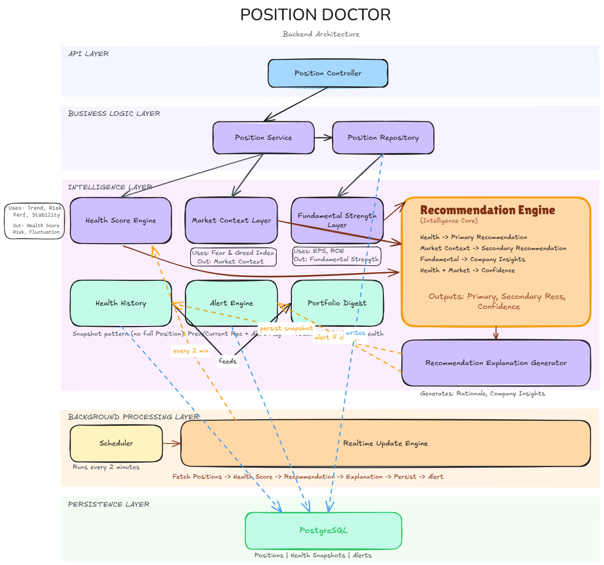

# Position Doctor Backend

Position Doctor is a Spring Boot backend for tracking stock positions, evaluating their health, and turning that evaluation into clear portfolio signals.

This backend is intentionally built as a set of small domain modules. Each module answers one question:

- What positions does the user hold?
- How healthy is each position?
- What changed over time?
- What is the current market backdrop?
- Is the company fundamentally strong?
- What action should the user consider?
- What alerts should the dashboard show?
- What does the portfolio look like right now?

The project is still hackathon-sized, but the backend is organized as if a small engineering team will keep extending it after the demo.

---

## Contents

- [Project Status](#project-status)
- [Engineering Journal](#engineering-journal)
- [Architecture Diagram](#architecture-diagram)
- [Backend Overview](#backend-overview)
- [Technology Stack](#technology-stack)
- [Package Map](#package-map)
- [Domain Modules](#domain-modules)
- [Core Flow](#core-flow)
- [REST API Reference](#rest-api-reference)
- [Database Model](#database-model)
- [Realtime Refresh](#realtime-refresh)
- [Local Setup](#local-setup)
- [PostgreSQL Setup](#postgresql-setup)
- [Running The Application](#running-the-application)
- [Useful Test Sequence](#useful-test-sequence)
- [Design Notes](#design-notes)
- [Known Local Setup Issue](#known-local-setup-issue)
- [Future Work](#future-work)

---

## Project Status

Implemented backend modules:

| Area | Status | Notes |
|---|---:|---|
| Position Management | Done | CRUD-style position APIs |
| Position Health Engine | Done | Deterministic health score from position risk, performance, and stability |
| Health History | Done | Persists health snapshots over time |
| Market Context Layer | Done | Fear & Greed Index only |
| Fundamental Strength Layer | Done | EPS and ROE only |
| Recommendation Engine | Done | Rule engine, not a scoring engine |
| Plain Language Rationales | Done | Deterministic explanations |
| Realtime Update Engine | Done | Scheduled refresh every 2 minutes |
| Alert Engine | Done | Persists recommendation-change alerts |
| Daily Portfolio Digest | Done | Dashboard summary using latest persisted data |

Future enhancements :

- Authentication
- External market data providers
- Email, SMS, push notifications
- WebSockets
- Kafka, Redis, async messaging
- Historical portfolio analytics
- Recommendation personalization

---

## Engineering Journal

This project has an engineering journal that explains the decisions, tradeoffs, and reasoning behind the backend design.

```text
ENGINEERING_JOURNAL.md
```

Recommended README link once the document is added:

```markdown
[Read the Engineering Journal](ENGINEERING_JOURNAL.md)
```

---

## Architecture Diagram

The final architecture diagram should live here:

```text
Position Doctor architecture.png
```

Recommended README embed once the diagram is ready:

```markdown

```

Diagram placeholder:

```text
+-------------------+      +-------------------+
| Position APIs     |      | Market Context    |
+---------+---------+      +---------+---------+
          |                          |
          v                          v
+-------------------+      +-------------------+
| Health Engine     |      | Fundamentals      |
+---------+---------+      +---------+---------+
          |                          |
          v                          |
+-------------------+                |
| Health History    |                |
+---------+---------+                |
          |                          |
          +------------+-------------+
                       v
             +-------------------+
             | Recommendation    |
             | Rule Engine       |
             +---------+---------+
                       |
                       v
             +-------------------+
             | Rationales        |
             | Alerts            |
             | Digest            |
             +-------------------+
```

---

## Backend Overview

Position Doctor evaluates a stock position from several independent angles:

1. **Position Health**
   Measures how the current position is behaving using risk, performance, and stability.

2. **Market Context**
   Stores and reports Fear & Greed Index readings.

3. **Fundamental Strength**
   Evaluates company quality using EPS and ROE only.

4. **Recommendation Engine**
   Applies explicit rules to health and market context to produce one primary action and optional secondary actions.

5. **Plain Language Rationales**
   Explains the already-decided recommendations in dashboard-friendly language.

6. **Realtime Update Engine**
   Refreshes active positions every 2 minutes and persists new health snapshots.

7. **Alert Engine**
   Creates alerts when the primary recommendation changes.

8. **Daily Digest**
   Aggregates the latest persisted state into a portfolio dashboard summary.

The important design boundary is this:

```text
Health decides health.
Market Context describes the market backdrop.
Fundamentals describe company quality.
Recommendations decide action.
Rationales explain decisions.
Digest summarizes persisted state.
```

---

## Technology Stack

| Tool | Purpose |
|---|---|
| Java 17 | Application language |
| Spring Boot 4.1.0 | Backend framework |
| Spring Web MVC | REST APIs |
| Spring Data JPA | Persistence |
| PostgreSQL | Database |
| Hibernate | ORM |
| Jakarta Validation | Request/entity validation |
| Lombok | Boilerplate reduction |
| Maven Wrapper | Build entry point |

Current Maven dependencies are intentionally small:

- `spring-boot-starter-webmvc`
- `spring-boot-starter-data-jpa`
- `spring-boot-starter-validation`
- `postgresql`
- `lombok`

---

## Package Map

Main package:

```text
org.example.positiondoctor
```

Current package layout:

```text
positiondoctor
├── Controller
├── DTO
├── Repository
├── Service
├── alert
│   ├── controller
│   ├── dto
│   ├── entity
│   ├── exception
│   ├── mapper
│   ├── repository
│   └── service
├── digest
│   ├── controller
│   ├── dto
│   └── service
├── entities
├── exception
├── fundamentalStrengthLayer
│   ├── controller
│   ├── dto
│   ├── entity
│   ├── enums
│   ├── evaluator
│   ├── exception
│   ├── mapper
│   ├── repository
│   └── service
├── health
│   ├── constraint
│   ├── controller
│   ├── dto
│   ├── enums
│   ├── evaluator
│   ├── history
│   ├── mapper
│   └── service
├── marketcontext
│   ├── controller
│   ├── dto
│   ├── entity
│   ├── enums
│   ├── evaluator
│   ├── exception
│   ├── mapper
│   ├── repository
│   └── service
├── realtime
│   ├── scheduler
│   └── service
└── recommendation
    ├── confidence
    ├── controller
    ├── dto
    ├── enums
    ├── explanation
    ├── mapper
    ├── rationale
    ├── rule
    └── service
```

Some early packages use uppercase names such as `Controller`, `DTO`, `Repository`, and `Service`. Newer modules use lowercase package names. The code still compiles as long as imports match the existing package structure.

---

## Domain Modules

### 1. Position Management

Position Management stores the user's stock positions.

Entity:

```text
Position
```

Fields:

- `id`
- `stockSymbol`
- `quantity`
- `buyPrice`
- `currentPrice`
- `targetPrice`
- `stopLoss`
- `createdAt`
- `active`

The `active` flag is used by the realtime refresh and digest modules.

Endpoints:

```text
POST   /positions
GET    /positions
GET    /positions/{id}
DELETE /positions/{id}
```

---

### 2. Position Health Engine

The Health Engine evaluates the condition of a position. It does not evaluate market sentiment or fundamentals.

Score model:

| Category | Range | Inputs |
|---|---:|---|
| Risk Score | 0-40 | Trend, distance to stop loss |
| Performance Score | 0-40 | P&L, distance to target |
| Stability Score | 0-20 | Volatility |

Total:

```text
healthScore = riskScore + performanceScore + stabilityScore
```

Main output:

```text
PositionHealthReport
```

Includes:

- `healthScore`
- `healthStatus`
- `riskLevel`
- `fluctuationLevel`
- `riskScore`
- `performanceScore`
- `stabilityScore`
- `factorBreakdown`

Important classes:

- `HealthScoreService`
- `RiskEvaluator`
- `PerformanceEvaluator`
- `StabilityEvaluator`
- `HealthConstraintProcessor`

Hard constraints are intentionally isolated in `HealthConstraintProcessor`.
More about the Health engine in this link : https://docs.google.com/document/d/17hykGhIfxSPzbseLS-hrfQCr0vJp8vPPE0efQv1EOzg/edit?usp=sharing
---

### 3. Health History

Health History stores point-in-time snapshots of health evaluations.

Entity:

```text
PositionHealthSnapshot
```

Stored values include:

- Position id
- Health score
- Risk score
- Performance score
- Stability score
- Health status
- Risk level
- Fluctuation level
- Primary recommendation
- Recommendation confidence
- Created timestamp

This module is used by:

- Latest health APIs
- Realtime refresh
- Alert change detection
- Daily digest

---

### 4. Market Context Layer

Market Context stores the market backdrop. The current implementation supports Fear & Greed Index only.

Entity:

```text
MarketContextSnapshot
```

Input:

```text
fearGreedIndex: 0-100
```

Output:

```text
MarketContextReport
```

Fear & Greed levels:

| Score | Level |
|---:|---|
| 0-24 | EXTREME_FEAR |
| 25-44 | FEAR |
| 45-55 | NEUTRAL |
| 56-75 | GREED |
| 76-100 | EXTREME_GREED |

Market Context does not generate recommendations. It provides facts for the Recommendation Engine.

---

### 5. Fundamental Strength Layer

Fundamental Strength evaluates the company behind the stock.

Inputs:

- EPS
- ROE

Output:

```text
FundamentalStrengthReport
```

Fields:

- `strengthScore`
- `strengthLevel`
- `eps`
- `roe`
- `explanation`

Strength levels:

- `WEAK`
- `MODERATE`
- `STRONG`

This module does not override recommendations. The Recommendation Engine includes fundamental strength as an independent company quality indicator.

---

### 6. Recommendation Engine

The Recommendation Engine is a rule engine.

It is not another scoring engine.

It consumes:

- `Position`
- `PositionHealthReport`
- `MarketContextReport`
- `FundamentalStrengthReport`

It returns:

```text
RecommendationResponse
```

Primary recommendations:

- `STRONG_HOLD`
- `HOLD`
- `WATCH_CLOSELY`
- `REDUCE_POSITION`
- `CONSIDER_EXIT`

Secondary recommendations:

- `BOOK_PROFIT`
- `TIGHTEN_STOP_LOSS`
- `HEDGE_POSITION`

Confidence is derived from:

```text
healthScore + market modifier
```

Fundamentals are not used to select the recommendation. They are included in the response separately.

---

### 7. Plain Language Rationales

Rationales are generated by deterministic `switch` statements.

Main class:

```text
RecommendationExplanationGenerator
```

Output:

```text
RecommendationExplanation
```

Fields:

- `recommendationRationale`
- `companyInsights`

No external services are used. No prompt-based text generation is used.

---

### 8. Realtime Update Engine

Realtime updates are simulated with Spring scheduling.

Scheduling is enabled in:

```text
PositionDoctorApplication
```

Scheduler:

```text
RealtimeScheduler
```

Runs every 2 minutes:

```java
@Scheduled(fixedRate = 120000)
```

The scheduler only calls:

```java
realtimeUpdateService.refreshAllPositions();
```

The business flow lives in `RealtimeUpdateServiceImpl`.

Refresh flow:

1. Fetch all active positions.
2. Recalculate health.
3. Generate recommendation.
4. Persist a new health snapshot.
5. Compare previous primary recommendation with current primary recommendation.
6. Create an alert if the primary recommendation changed.
7. Continue processing remaining positions even if one position fails.

---

### 9. Alert Engine

The Alert Engine persists recommendation-change alerts.

Alert creation rule:

```text
Create an alert only when the primary recommendation changes.
```

Example:

```text
HOLD -> WATCH_CLOSELY = alert
WATCH_CLOSELY -> WATCH_CLOSELY = no alert
```

Entity:

```text
Alert
```

Fields:

- `id`
- `positionId`
- `stockSymbol`
- `previousRecommendation`
- `currentRecommendation`
- `message`
- `createdAt`
- `isRead`

There is no notification delivery. The frontend fetches alerts from the API.

---

### 10. Daily Portfolio Digest

The digest is a read-only dashboard summary.

It does not recalculate health.
It does not regenerate recommendations.

It uses:

- Active positions
- Latest persisted health snapshots
- Unread alerts

Output:

```text
PortfolioDigestResponse
```

Includes:

- Total positions
- Healthy positions
- Watch closely count
- Reduce position count
- Consider exit count
- Average health score
- Highest health position
- Lowest health position
- Highest confidence recommendation
- Lowest confidence recommendation
- Unread alerts count

---

## Core Flow

### Manual evaluation flow

```text
Client
  -> Position API
  -> Health API
  -> Recommendation API
  -> Response with recommendation and explanation
```

### Scheduled refresh flow

```text
RealtimeScheduler
  -> RealtimeUpdateService
  -> PositionRepository
  -> HealthScoreService
  -> MarketContextService
  -> FundamentalStrengthService
  -> RecommendationEngineService
  -> HealthHistoryService
  -> AlertService
```

### Dashboard flow

```text
Frontend Dashboard
  -> GET /api/v1/digest
  -> PortfolioDigestService
  -> PositionRepository
  -> HealthHistoryService
  -> AlertService
```

---

## REST API Reference

Base URL for local development:

```text
http://localhost:8080
```

### Position APIs

| Method | Endpoint | Description |
|---|---|---|
| POST | `/positions` | Create a position |
| GET | `/positions` | Get all positions |
| GET | `/positions/{id}` | Get one position |
| DELETE | `/positions/{id}` | Delete one position |

Example request:

```json
{
  "stockSymbol": "AAPL",
  "quantity": 10,
  "buyPrice": 100.00,
  "currentPrice": 120.00,
  "targetPrice": 130.00,
  "stopLoss": 95.00
}
```

---

### Health APIs

| Method | Endpoint | Description |
|---|---|---|
| GET | `/api/v1/health/{positionId}` | Evaluate stored position health and save snapshot |
| POST | `/api/v1/health/evaluate` | Evaluate a temporary position without saving it |
| GET | `/api/v1/health/{positionId}/history` | Get health history |
| GET | `/api/v1/health/{positionId}/latest` | Get latest health snapshot |

Example sandbox request:

```json
{
  "stockSymbol": "AAPL",
  "quantity": 10,
  "buyPrice": 100.00,
  "currentPrice": 120.00,
  "targetPrice": 130.00,
  "stopLoss": 95.00
}
```

Example health response:

```json
{
  "healthScore": 77,
  "healthStatus": "HEALTHY",
  "riskLevel": "SAFE",
  "fluctuationLevel": "MODERATE",
  "riskScore": 30,
  "performanceScore": 35,
  "stabilityScore": 12,
  "factorBreakdown": {
    "trendContribution": 12,
    "stopLossContribution": 18,
    "pnlContribution": 20,
    "targetContribution": 15,
    "volatilityContribution": 12
  }
}
```

---

### Market Context APIs

| Method | Endpoint | Description |
|---|---|---|
| POST | `/api/v1/market-context/fear-greed` | Store Fear & Greed Index |
| GET | `/api/v1/market-context/latest` | Get latest market context |
| GET | `/api/v1/market-context/history` | Get market context history |

Example request:

```json
{
  "fearGreedIndex": 72
}
```

Example response:

```json
{
  "id": 1,
  "fearGreedIndex": 72,
  "fearGreedLevel": "GREED",
  "createdAt": "2026-07-01T10:30:00"
}
```

---

### Fundamental APIs

| Method | Endpoint | Description |
|---|---|---|
| POST | `/api/v1/fundamentals` | Store EPS and ROE for a stock |
| GET | `/api/v1/fundamentals/{stockSymbol}` | Evaluate latest fundamentals |

Example request:

```json
{
  "stockSymbol": "AAPL",
  "eps": 6.12,
  "roe": 28.40
}
```

Example response:

```json
{
  "strengthScore": 100,
  "strengthLevel": "STRONG",
  "eps": 6.12,
  "roe": 28.40,
  "explanation": "The company demonstrates strong profitability and efficient capital utilization."
}
```

---

### Recommendation APIs

| Method | Endpoint | Description |
|---|---|---|
| GET | `/api/v1/recommendations/{positionId}` | Generate latest recommendation for one position |

Example response:

```json
{
  "primaryRecommendation": "HOLD",
  "secondaryRecommendations": [
    "TIGHTEN_STOP_LOSS"
  ],
  "confidence": 80,
  "rationale": "The position can be held, but conditions should continue to be monitored. The position is profitable, so tightening the stop-loss can help protect gains.",
  "explanation": {
    "recommendationRationale": "The position can be held, but conditions should continue to be monitored. The position is profitable, so tightening the stop-loss can help protect gains.",
    "companyInsights": "The company demonstrates strong profitability and efficient capital utilization."
  },
  "fundamentalStrength": "STRONG",
  "healthScore": 90,
  "fearGreedLevel": "FEAR"
}
```

---

### Alert APIs

| Method | Endpoint | Description |
|---|---|---|
| GET | `/api/v1/alerts` | Get all alerts |
| GET | `/api/v1/alerts/unread` | Get unread alerts |
| PATCH | `/api/v1/alerts/{id}/read` | Mark alert as read |

Example response:

```json
[
  {
    "stockSymbol": "AAPL",
    "previousRecommendation": "HOLD",
    "currentRecommendation": "WATCH_CLOSELY",
    "message": "Holding recommendation has changed to WATCH_CLOSELY due to declining position health.",
    "createdAt": "2026-07-01T11:00:00",
    "isRead": false
  }
]
```

---

### Digest API

| Method | Endpoint | Description |
|---|---|---|
| GET | `/api/v1/digest` | Get current portfolio dashboard summary |

Example response:

```json
{
  "totalPositions": 5,
  "healthyPositions": 2,
  "watchCloselyPositions": 1,
  "reducePositionRecommendations": 1,
  "considerExitRecommendations": 1,
  "averageHealthScore": 67.4,
  "highestHealthPosition": "MSFT",
  "highestHealthScore": 91,
  "lowestHealthPosition": "TSLA",
  "lowestHealthScore": 35,
  "highestConfidencePosition": "MSFT",
  "highestConfidenceRecommendation": "STRONG_HOLD",
  "highestConfidence": 96,
  "lowestConfidencePosition": "TSLA",
  "lowestConfidenceRecommendation": "CONSIDER_EXIT",
  "lowestConfidence": 30,
  "unreadAlerts": 3
}
```

---

## Database Model

Hibernate is currently configured with:

```properties
spring.jpa.hibernate.ddl-auto=update
```

That means tables are created and updated automatically during development.

Main tables:

| Table | Purpose |
|---|---|
| `positions` | User stock positions |
| `position_health_snapshots` | Health and recommendation snapshots |
| `market_context_snapshots` | Fear & Greed Index snapshots |
| `fundamental_metrics` | EPS and ROE records |
| `alerts` | Recommendation-change alerts |

Useful indexes already defined in entities:

| Table | Index |
|---|---|
| `position_health_snapshots` | `position_id` |
| `position_health_snapshots` | `position_id, created_at` |
| `market_context_snapshots` | `created_at` |
| `fundamental_metrics` | `stock_symbol` |
| `fundamental_metrics` | `stock_symbol, created_at` |
| `alerts` | `position_id` |
| `alerts` | `created_at` |

---

## Realtime Refresh

Scheduling is enabled with:

```java
@EnableScheduling
```

The refresh job runs every 2 minutes:

```java
@Scheduled(fixedRate = 120000)
```

The scheduler logs start and finish events. Per-position failures are caught inside `RealtimeUpdateServiceImpl`, so one bad position does not stop the rest of the portfolio refresh.

Important behavior:

- Refresh uses active positions only.
- Each refresh writes a new health snapshot.
- Alerts are created only when the primary recommendation changes.
- Notification delivery is intentionally not implemented.

---

## Local Setup

### Prerequisites

- JDK 17
- PostgreSQL
- pgAdmin or another PostgreSQL client
- IntelliJ IDEA or any Java IDE
- Maven Wrapper from this repository

### Required environment variables

```powershell
$env:DB_USERNAME="postgres"
$env:DB_PASSWORD="your_postgres_password"
```

Optional:

```powershell
$env:DB_URL="jdbc:postgresql://localhost:5432/position_doctor"
```

If `DB_URL` is not set, the app uses:

```text
jdbc:postgresql://localhost:5432/position_doctor
```

---

## PostgreSQL Setup

1. Start PostgreSQL.
2. Open pgAdmin.
3. Connect to local PostgreSQL.
4. Create a database:

```text
position_doctor
```

5. Make sure your application has credentials for the database.

Default configuration:

```properties
spring.datasource.url=${DB_URL:jdbc:postgresql://localhost:5432/position_doctor}
spring.datasource.username=${DB_USERNAME:postgres}
spring.datasource.password=${DB_PASSWORD:}
spring.datasource.driver-class-name=org.postgresql.Driver
```

---

## Running The Application

From the project root:

```powershell
.\mvnw.cmd spring-boot:run
```

Or run:

```text
PositionDoctorApplication
```

from IntelliJ.

The backend starts on:

```text
http://localhost:8080
```

---

## Useful Test Sequence

This order gives the Recommendation and Digest modules enough data to work with.

### 1. Create a position

```http
POST /positions
```

```json
{
  "stockSymbol": "AAPL",
  "quantity": 10,
  "buyPrice": 100.00,
  "currentPrice": 120.00,
  "targetPrice": 130.00,
  "stopLoss": 95.00
}
```

### 2. Store market context

```http
POST /api/v1/market-context/fear-greed
```

```json
{
  "fearGreedIndex": 42
}
```

### 3. Store fundamentals

```http
POST /api/v1/fundamentals
```

```json
{
  "stockSymbol": "AAPL",
  "eps": 6.12,
  "roe": 28.40
}
```

### 4. Generate recommendation

```http
GET /api/v1/recommendations/1
```

### 5. Trigger health snapshot manually

```http
GET /api/v1/health/1
```

The realtime scheduler will also create snapshots automatically every 2 minutes.

### 6. Read digest

```http
GET /api/v1/digest
```

### 7. Read alerts

```http
GET /api/v1/alerts
GET /api/v1/alerts/unread
PATCH /api/v1/alerts/1/read
```

---

## Design Notes

### Why modules are separate

The project avoids placing all logic inside one service. Position health, market context, fundamentals, recommendations, alerts, and digest each have a separate reason to change.

### Why the Recommendation Engine is rule-based

The recommendation layer is meant to be explainable. It does not average scores or create hidden weights. It reads facts and applies rules.

### Why the digest uses persisted snapshots

The digest is a dashboard summary of the current persisted state. It does not recalculate health or regenerate recommendations because that would mix reporting with decision-making.

### Why the realtime system uses scheduling

For the hackathon, a simple scheduled refresh gives the feel of near real-time updates without introducing Kafka, WebSockets, Redis, or background worker complexity.

### Why alerts are persisted only

The backend records that something important changed. Delivery channels can be added later without changing the alert creation rule.

---

## Known Local Setup Issue

The Maven wrapper has been unable to compile in this environment because `JAVA_HOME` is not configured correctly:

```text
The JAVA_HOME environment variable is not defined correctly
```

Fix on Windows:

```powershell
$env:JAVA_HOME="C:\Program Files\Java\jdk-17"
$env:Path="$env:JAVA_HOME\bin;$env:Path"
```

Then verify:

```powershell
java -version
.\mvnw.cmd -v
```

---

## Future Work

Good next steps:

- Add authentication and user ownership for positions.
- Add request/response tests for each controller.
- Add service-level unit tests for scoring and recommendations.
- Add database migrations with Flyway or Liquibase.
- Add OpenAPI documentation.
- Add a proper market data ingestion layer.
- Add frontend-facing pagination for alerts and history.
- Add retention rules for old health snapshots.
- Add notification delivery after the alert model settles.
- Normalize package names to lowercase across the early modules.

---

## Project Principle

Position Doctor is not trying to predict the market.

It is trying to make position review more disciplined:

- measure the position,
- explain the condition,
- surface changes,
- and give the user a clear dashboard to act from.

